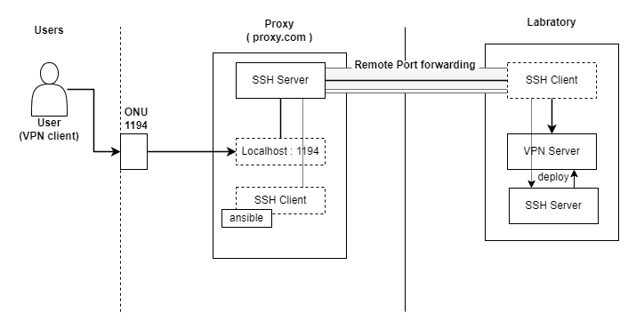

# 研究室のVPN構築
研究室でのVPN構築についての手順としていますが、外部からのアクセス条件の厳しい環境下での構築についてです。以下の図を参考に説明を進めていきます。



## 前提
- ある程度自由に設定できるネットワーク環境(図のproxy部分)があること
- 研究室側からProxy側にSSH接続できること
- 研究室側のPCで管理者権限を利用できること (VPNサーバ立ち上げ時に必要)

## 準備
1. 研究室側からProxy側へのリモートポートフォワードをして、外部から接続できるようにする。このとき、ProxyのSSHサーバで以下の設定を有効にしておく。
    ```yaml
    GatewayPorts: yes
    ```

2. Proxy側のPCにAnsibleを入れて、[OpenVPN構築に利用するrole](https://galaxy.ansible.com/ui/standalone/roles/kyl191/openvpn/)を入れておく。

3. 上記のroleについて，`~/.ansible/roles/kyl191.openvpn/templates`内の`client.ovpn.j2`を以下のように編集する。
    ```diff yaml
    - remote {{ openvpn_server_hostname }} {{ openvpn_port }}
    + 
    + remote {{ openvpn_server_hostname }} {{ openvpn_client_port }}
    + 
    + remote {{ openvpn_server_hostname }} {{ openvpn_port }}
    + 
    ```

## 構築
ansibleでSSHトンネルを利用して，VPNサーバを構築する。ansibleが利用する経路は以下のように`hosts.yaml`を書いてイベントリを用意。
```yaml:hosts.yaml
all:
  hosts:
    labVPN:
      ansible_host: localhost
      ansible_port: 22 # 研究室側のSSHサーバへのポートフォワード
      ansible_user: root
      ansible_ssh_private_key_file: ~/.ssh/key # 研究室側のSSHサーバ用の鍵
```
また，`vars.yaml`として、以下のように変数を保存しておく。
```yaml:vars.yaml
proxy_hostname: "proxy.com"
server_port: 1194
proxy_bool: false
```
VPNサーバについて、研究室内でのポートとポートフォワード先とのポートが異なる場合は`proxy_bool: true`とし，`proxy_port: [port number]`とすることで設定できる。

ここまで来たら、以下でデプロイして終了。
```bash
ansible-playbook -i hosts.yaml playbook.yaml
```

## 運用
`playbook.yaml`内の一番下のclientsの項目を増やして、デプロイすれば新しい鍵を作成することができる。鍵はサーバ側の`/etc/openvpn/ovpn`にあり，それを配布すればよい。

ユーザ側には，VPNクライアントアプリを入れてもらい，渡した鍵を登録してもらうだけで接続できる。認証が通らない場合は、Firewallを編集し，VPNサーバで利用しているポートを開放すればおそらくできる。
